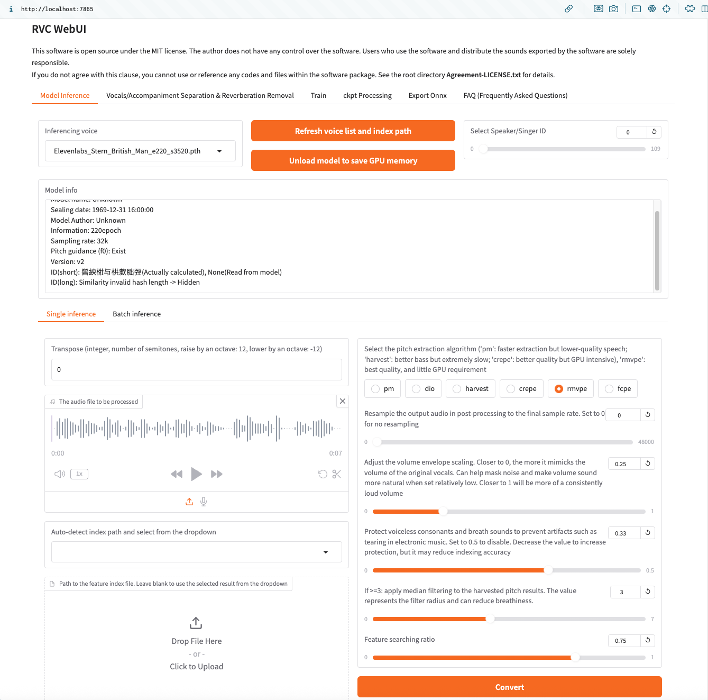
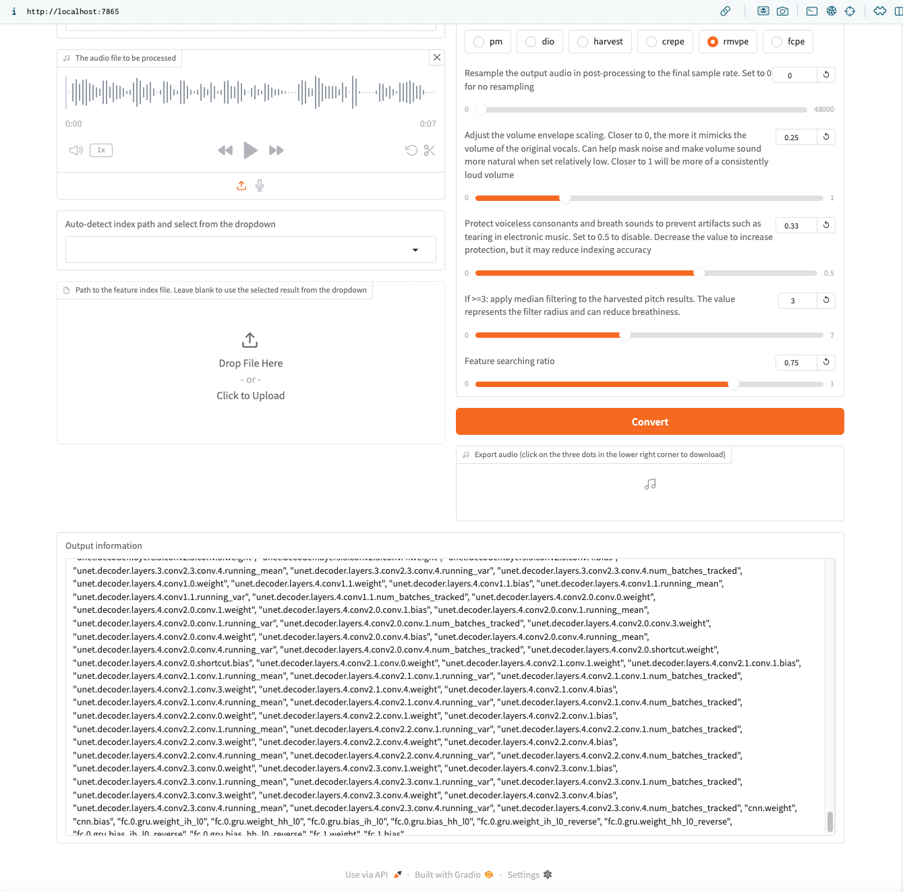

# Errors in Output Information Box When Doing Convert

## Describe the bug
The RVC WebUI Interface is up and operational on my M1 Mac Mini (16 GB RAM). I loaded a few v2 "Inferencing voice" models, which show and load correctly in the dropdown list and also show information in the "Model Info" box. I can upload an audio file to be processed. Pitch extraction algorithm is set to the default rmvpe. But, when I click the convert button, I get a lot of error messages in the "Output Information" box.

## To Reproduce
Steps to reproduce the behavior:

Go to http://localhost:7865/
Select Inferencing voice
Upload audio file to be processed (which is a small .wav file and loads properly)
Pitch extraction algorithm is set to default: rmvpe
Click convert button
I expected to see a successful conversion.
See errors in attached screenshots.
Screenshots
See screenshots to help explain the problem.

Desktop (please complete the following information):

OS and version: Apple M1 (2020) MacOS Sequoia 15.5
Python version: [e.g. 3.9.7, 3.11]
Commit/Tag with the issue: [e.g. 22]

## Additional context
I've tried lots of v2 Inferencing voice files and making sure they are placed in the correct location, and they do show up and load properly in the RVC WebUI. Maybe we need a new hubert_base.pt file and maybe a new rmvpe.pt file? The files I have were loaded from this location, and appear to be the right sizes - although the hubert_base.pt (189.5 MB) seems to be smaller than the larger 350-400 MB usually used on Windows.

